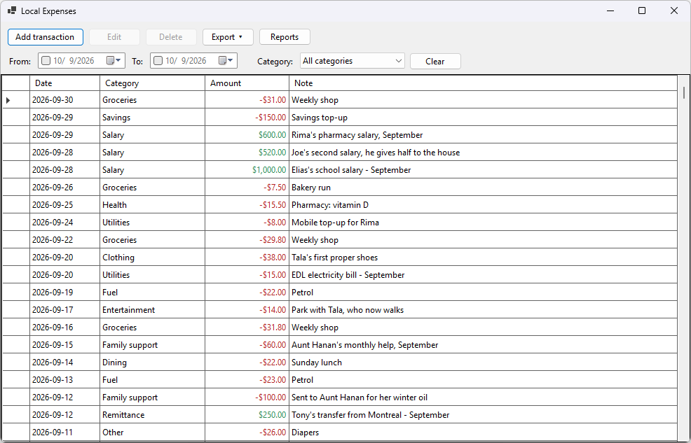
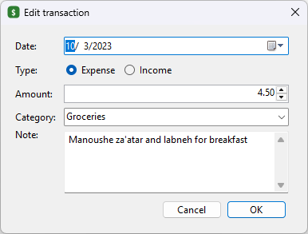
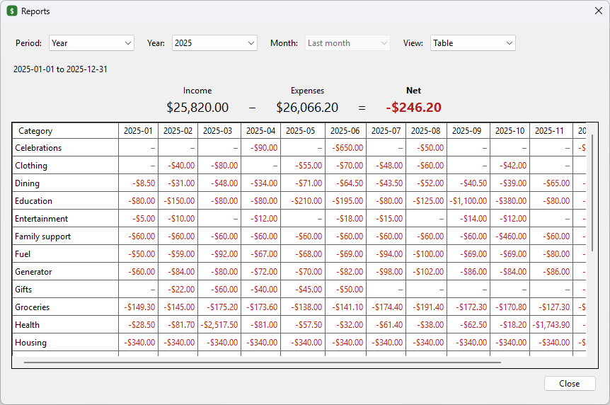
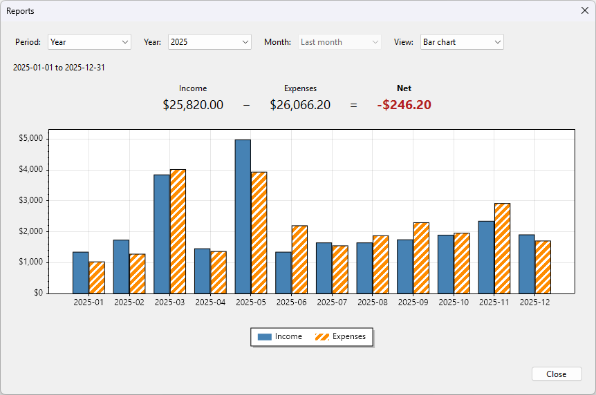
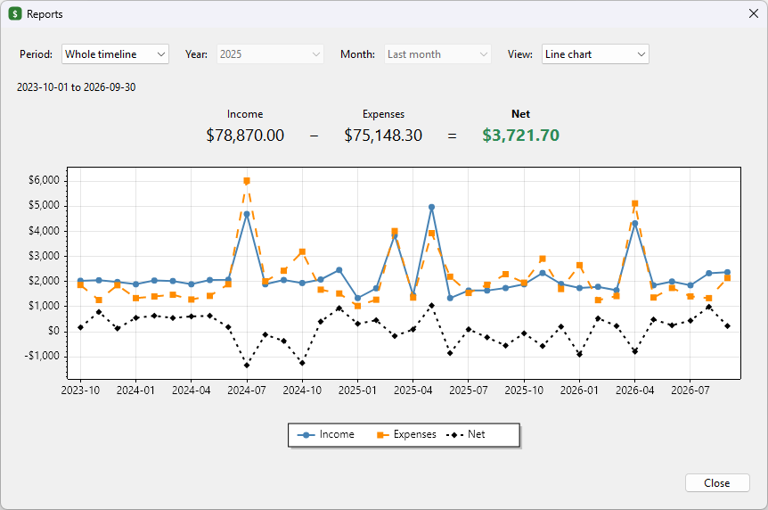

# LocalExpense

A local-first personal expense tracker for Windows. Your data stays in a single SQLite file on your machine: no server, no account, no network.

Built with .NET 10, Windows Forms, Entity Framework Core (SQLite) and [ScottPlot](https://scottplot.net/).



*Screenshots show the bundled sample data: three years of a fictional family's household money (see [Sample data](#sample-data)).*

## Features

- **Transactions.** Add, edit (double-click a row) and delete them; select several rows to delete them at once. Expenses show in red with a minus sign, income in green.
- **Filters.** Narrow the list to a date range (either end optional) and a category. The list updates as you change a filter.
- **CSV export.** Export the filtered rows or all transactions, newest first, as a UTF-8 CSV that Excel opens directly. Text that a spreadsheet would run as a formula (`=`, `+`, `-`, `@`) is protected with a leading apostrophe. The file is written to a temporary file first, so a failed export never leaves a half-written file behind.
- **Reports.** Income, expenses and net for:
  - a calendar month or the last month,
  - a calendar year or the last 12 months,
  - the whole timeline.

  The breakdown can be:
  - a table of each category's net per day, month or year,
  - a line chart of income, expenses and net,
  - a bar chart of income against expenses.
- **Sample data window.** Try everything on three years of a fictional family's money without touching your own data ([below](#sample-data)).
- **CSV import and sample data generator** in a small command-line tool ([below](#command-line-tool)).

## Screenshots

| | |
|---|---|
|  |  |
| **Edit a transaction.** The same dialog adds new ones. | **Reports, table view.** Each category's net per month for 2025, with a total row and column (scrolls sideways). |
|  |  |
| **Bar chart.** Income against expenses, month by month. | **Line chart.** Three years of income, expenses and net. |

How finely a period is sliced:

| Period | Table and bar chart | Line chart |
|---|---|---|
| A month, or the last month | by day | by day |
| A year, or the last 12 months | by month | by month |
| The whole timeline | by month, or by year when it spans more than 24 months | by month |

## Getting started

Requires Windows and the [.NET 10 SDK](https://dotnet.microsoft.com/download).

```powershell
dotnet test LocalExpense.sln
dotnet run --project src/LocalExpense.App
```

On first launch, the database is created and migrated at `%LocalAppData%\LocalExpense\localexpense.db`. Back up that one file to back up everything.

## Sample data

[`samples/lebanon-family-expenses.csv`](samples/lebanon-family-expenses.csv) holds 1,383 transactions, from October 2023 to September 2026, of the Khourys, a fictional family in Zahlé. [`samples/LebanonFamilyStory.md`](samples/LebanonFamilyStory.md) tells the story behind the numbers: a used car, a newborn, a funeral, a solar panel. The data is realistic enough to make the reports worth looking at.

**To try the app with it, click Sample data** in the main window. A second window opens titled "Local Expenses (sample data)", running on a throwaway copy of the sample in a temporary database. Your own data is never touched, and anything you change there is discarded when you close that window. The sample is built into the exe, and its dates are moved so they end last month, which keeps "Last month" and "Last year" in Reports full. Running the app with `--demo` opens the same window directly.

To load the sample into your real database instead, launch the app once so its database exists, close it, then run:

```powershell
dotnet run --project tools/LocalExpense.Cli -- import -i samples/lebanon-family-expenses.csv -d "$env:LOCALAPPDATA\LocalExpense\localexpense.db"
```

Importing adds rows and never replaces or merges them. Importing the same file twice adds every row twice. The imported dates are not moved.

## Command-line tool

`tools/LocalExpense.Cli` is a developer tool for getting data in:

```powershell
# Validate a CSV without touching any database
dotnet run --project tools/LocalExpense.Cli -- import -i data.csv --dry-run

# Add every row of a CSV to a database (--create makes a new one)
dotnet run --project tools/LocalExpense.Cli -- import -i data.csv -d my.db

# Write a deterministic sample CSV: 30 months of salary, rent, groceries and so on, with one empty month in the middle
dotnet run --project tools/LocalExpense.Cli -- seed -o sample.csv --months 30 --random-seed 42
```

Run it with `--help` for every option. An import is all or nothing: if any row is invalid, the tool lists the problems with their line numbers and writes nothing.

## CSV format

The format the app exports and the tool imports:

```csv
Id,Date,Category,Amount,Note
2,2025-03-02,Food,-45.25,lunch
1,2025-03-01,Salary,1500.00,
```

- **Columns** are matched by header name, in any order. `Date`, `Category` and `Amount` are required, `Note` is optional, and `Id` is ignored on import.
- **Date** is `yyyy-MM-dd`.
- **Amount** is signed: negative is an expense, positive is income. It uses a `.` decimal point, has at most two decimals, and is neither zero nor beyond ±999,999,999.99.
- **Category** is required, up to 100 characters. **Note** is up to 500 characters. Both are trimmed, and a blank note is stored as empty.
- Fields follow RFC 4180, so commas, quotes and line breaks inside quoted fields are fine. The apostrophe the exporter adds in front of formula-like text is removed again on import.

## Project structure

```
src/LocalExpense.App     WinForms front end: main window, transaction dialog, Reports window and charts, DI setup
src/LocalExpense.Core    Models, Money, EF Core context and migrations, TransactionService,
                         CSV export and import, period and report calculations
tools/LocalExpense.Cli   Command-line import and sample data generator
tests/LocalExpense.Tests xUnit tests against real SQLite, including concurrency
samples                  The sample family's CSV (built into the app for the Sample data window) and their story
docs/screenshots         The images in this README
```

## Design notes

- **Money is stored as integer cents** (`long AmountMinor`), never as a decimal, so totals are exact and summed in SQL. Currency and decimal places are hard-coded in `Money.cs` (USD, 2 decimals). Change them before storing real data.
- **Negative amounts are expenses, positive amounts are income.**
- **One set of rules.** `TransactionService`, the CSV importer and the edit dialog enforce the same limits.
- **Categories are matched exactly.** "Food" and "food" are two categories. Lists sort them case-insensitively, so they appear side by side.
- **Reports are calculated in memory** from a single query that returns daily totals per category, so the summary, the table and the charts always agree.
- **Culture-independent.** CSV files, report labels and amounts don't depend on the Windows regional settings.
- Each service call opens a short-lived `DbContext` from a factory; no context is shared across the UI.

## Migrations

```powershell
dotnet ef migrations add <Name> -o Data/Migrations --project src/LocalExpense.Core --startup-project src/LocalExpense.App
```

## License

See [LICENSE.txt](LICENSE.txt).
